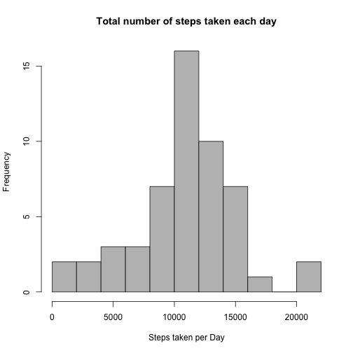
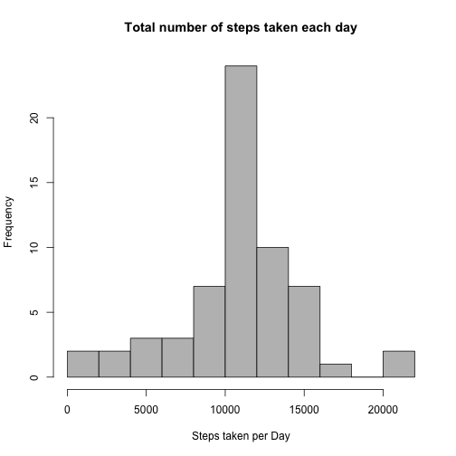
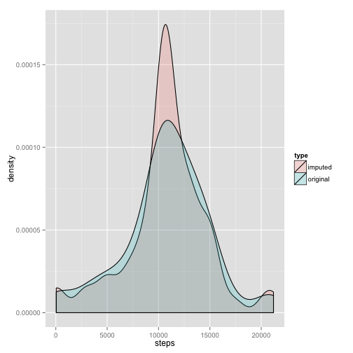
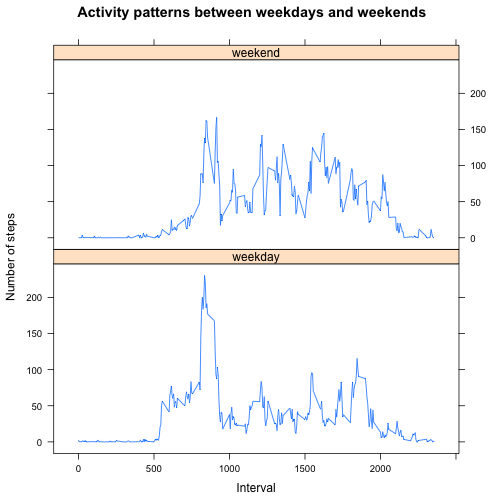

Reproducible Research: Peer Assessment 1
========================================

# Activity Monitoring Data Analysis
With activity monitoring devices such as a Fitbit, Nike Fuelband, or Jawbone Up, it is possible to collect a large amount of data about personal movement using. This allows individuals who take measurements about themselves regularly to improve their health, find patterns in their behavior out of pure curiosity because they are tech geeks. The assignment makes use of data from a personal activity monitoring device. This device collects data at 5 minute intervals through out the day. The data consists of two months of data from an anonymous individual collected during the months of October and November, 2012 and include the number of steps taken in 5 minute intervals each day.

## Loading and preprocessing the data


```r
data <- read.csv("~/Documents/Coursera/Reproducible Research/Week 1/RepData_PeerAssessment1/activity.csv")
```

## What is mean total number of steps taken per day?
- Make a histogram of the total number of steps taken each day


```r
steps_taken_per_day <- aggregate(steps ~ date, data, sum)$steps
hist(steps_taken_per_day, breaks=10, col="gray", main = "Total number of steps taken each day", xlab = "Steps taken per Day")
```

 

- Calculate and report the mean and median total number of steps taken per day


```r
mean_steps <- format(mean(steps_taken_per_day, na.rm=TRUE), nsmall=2)
median_steps <- median(steps_taken_per_day, na.rm=TRUE)
mean_steps
```

```
## [1] "10766.19"
```

```r
median_steps
```

```
## [1] 10765
```

For the current data set, the mean total number of steps is 10766.19 and the median total number of steps taken per day is 10765.

## What is the average daily activity pattern?

- Make a time series plot (i.e. type = "l") of the 5-minute interval (x-axis) and the average number of steps taken, averaged across all days (y-axis)


```r
steps_taken_in_interval <- aggregate(steps ~ interval, data, mean)
plot(steps_taken_in_interval$steps, type="l", main="Average daily activity pattern", xlab="Interval", ylab="Steps taken in interval")
```

 

- Which 5-minute interval, on average across all the days in the dataset, contains the maximum number of steps?


```r
max_row <- which.max(steps_taken_in_interval$steps)
max_row
```

```
## [1] 104
```

```r
# Retrieve interval number
max_interval <- steps_taken_in_interval[max_row,1]
max_interval
```

```
## [1] 835
```
The 5-minute interval no. 835, contained on average the maximum number of stegs across all the days in the dataset.

## Imputing missing values

- Calculate and report the total number of missing values in the dataset (i.e. the total number of rows with NAs)


```r
number_NA <- sum(is.na(data$steps))
number_NA
```

```
## [1] 2304
```

The total number of missing values in the dataset is 2304. 

- Devise a strategy for filling in all of the missing values in the dataset. The strategy does not need to be sophisticated. For example, you could use the mean/median for that day, or the mean for that 5-minute interval, etc.

Missing values in the dataset are imputed using the mean for the 5-minute interval for which the number of steps were missing. This strategy should account better for differences in hourly activity pattern, than utilizing the daily average number of steps.

- Create a new dataset that is equal to the original dataset but with the missing data filled in.


```r
library(plyr)
impute.mean <- function(x) replace(x, is.na(x), mean(x, na.rm = TRUE))
data2 <- ddply(data, ~ interval, transform, steps = impute.mean(steps))
sum(is.na(data2$steps))
```

```
## [1] 0
```

- Make a histogram of the total number of steps taken each day and Calculate and report the mean and median total number of steps taken per day. Do these values differ from the estimates from the first part of the assignment? What is the impact of imputing missing data on the estimates of the total daily number of steps?


```r
steps_taken_per_day_imp <- aggregate(steps ~ date, data2, sum)$steps
hist(steps_taken_per_day_imp, breaks=10, col="gray", main = "Total number of steps taken each day", xlab = "Steps taken per Day")
```

 


```r
mean_steps_imp <- format(mean(steps_taken_per_day_imp), nsmall=2)
median_steps_imp <- format(median(steps_taken_per_day_imp), nsmall=2)
mean_steps_imp
```

```
## [1] "10766.19"
```

```r
median_steps_imp
```

```
## [1] "10766.19"
```

Using the imputed data, the mean total number of steps is 10766.19 and the median total number of steps taken per day is 10766.19. This represents a small difference compared to the original dataset, where the mean total number of steps is 10766.19 and the median total number of steps taken per day is 10765.

PLotting both, original and imputed data points for the current dataset together, the density plot below shows very clearly that the strategy to replace the missing values with the mean over the specific 5-minute interval yielded imputed values that represent the overall trends for that interval and show a higher density of the mean values. This replacement of the missing values does not account for differences in activity over the week, it treats every day the same.


```r
#Combine imputed and real data into simgle data frame
steps_taken_per_day_ocomb <- as.data.frame(aggregate(steps ~ date, data, sum))
steps_taken_per_day_icomb <- as.data.frame(aggregate(steps ~ date, data2, sum))
steps_taken_per_day_ocomb$type <- "original"
steps_taken_per_day_icomb$type <- "imputed"
data_comb <- rbind(steps_taken_per_day_ocomb, steps_taken_per_day_icomb)

# Show combined density plot
library(ggplot2)
ggplot(data_comb, aes(steps, fill = type)) + geom_density(alpha = 0.2)
```

 

## Are there differences in activity patterns between weekdays and weekends?

- Create a new factor variable in the dataset with two levels – “weekday” and “weekend” indicating whether a given date is a weekday or weekend day.


```r
library(timeDate)
# Assign weekday names
data2$weekday <- weekdays(as.Date(data2$date))

# Assign weekday type (weekday vs. weekend)
data2$day_type <- isWeekday(data2$date)
data2$day_type <- gsub("TRUE", "weekday",data2$day_type)
data2$day_type <- gsub("FALSE", "weekend",data2$day_type)
```

- Make a panel plot containing a time series plot (i.e. type = "l") of the 5-minute interval (x-axis) and the average number of steps taken, averaged across all weekday days or weekend days (y-axis). The plot should look something like the following, which was creating using simulated data:


```r
library(lattice)
steps_taken_in_interval_day_type <- aggregate(steps ~ interval + day_type, data2, mean)
xyplot(steps ~ interval | day_type, data = steps_taken_in_interval_day_type, layout = c(1, 2), type="l", ylab="Number of steps", xlab="Interval", main="Activity patterns between weekdays and weekends")
```

 

The activity patterns for the current dataset indicate clear differences between weekday and weekend, showing earlier times of activity during the week, as well as a characteristic spike of activity, compared to a more even activity distribution on the weekend.
